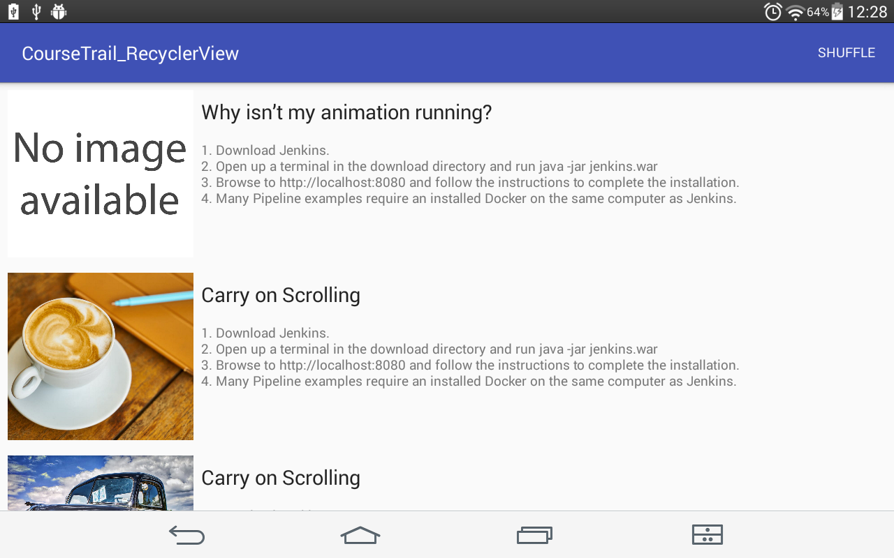
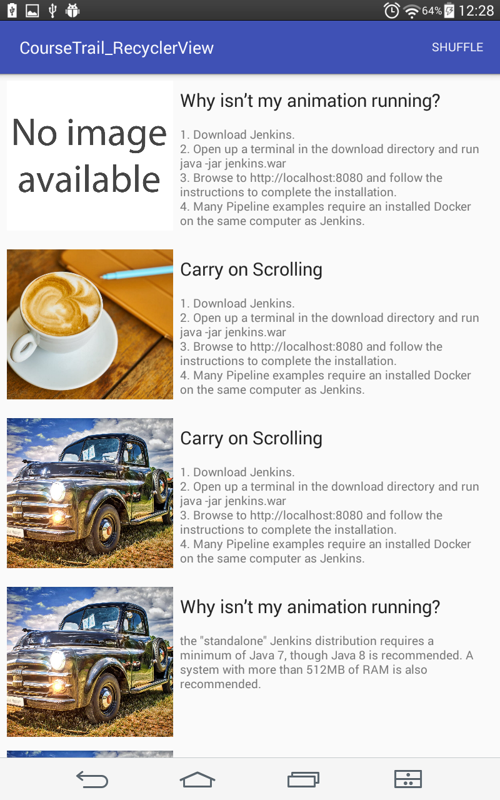
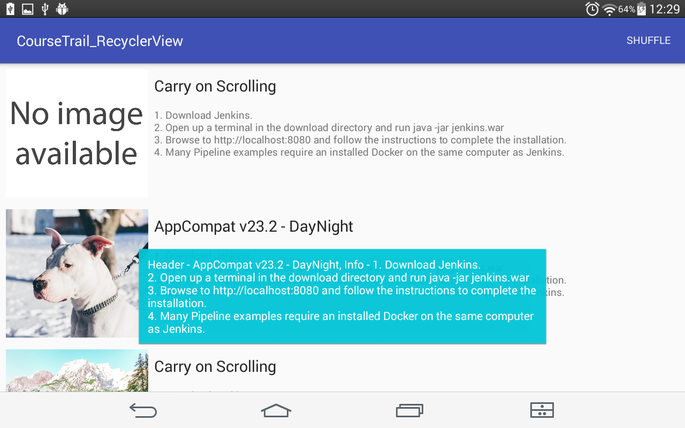

# using Recycler View

In this app I'm using RecyclerView to display 1000 items with images from resources and two text views.

Info for items is generated randomly.

On turning your device all items are stored in the instance state Bundle as ParcelableArrayList.

You can change items in the list by using "shuffle" menu item.

Also on clicking item from the list app shows Toast with header and info of the list item.

